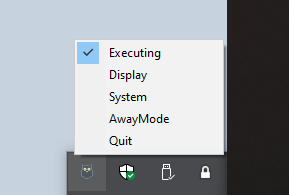

<div align="center">
	
	<h1>GoInsomnia</h1>
	<p>
		<b>Prevent computer from going to sleep</b>
	</p>
	<br>
	<br>
	<br>
</div>

Build app
---
````
go build -ldflags -H=windowsgui -trimpath
````

Build resources with go-bindata
---
````
go-bindata .\icon.ico
````

File icon, use rsrc 
---
````
.\rsrc_windows_amd64.exe -ico .\icon.ico -o FILE.syso
````
